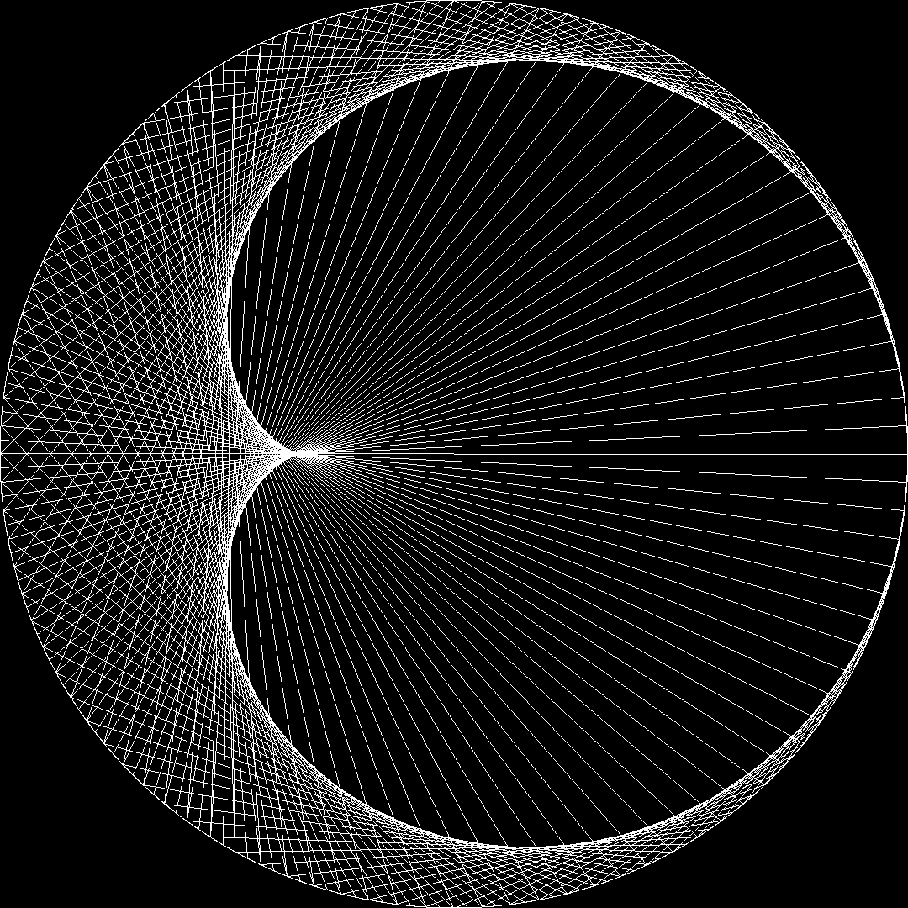
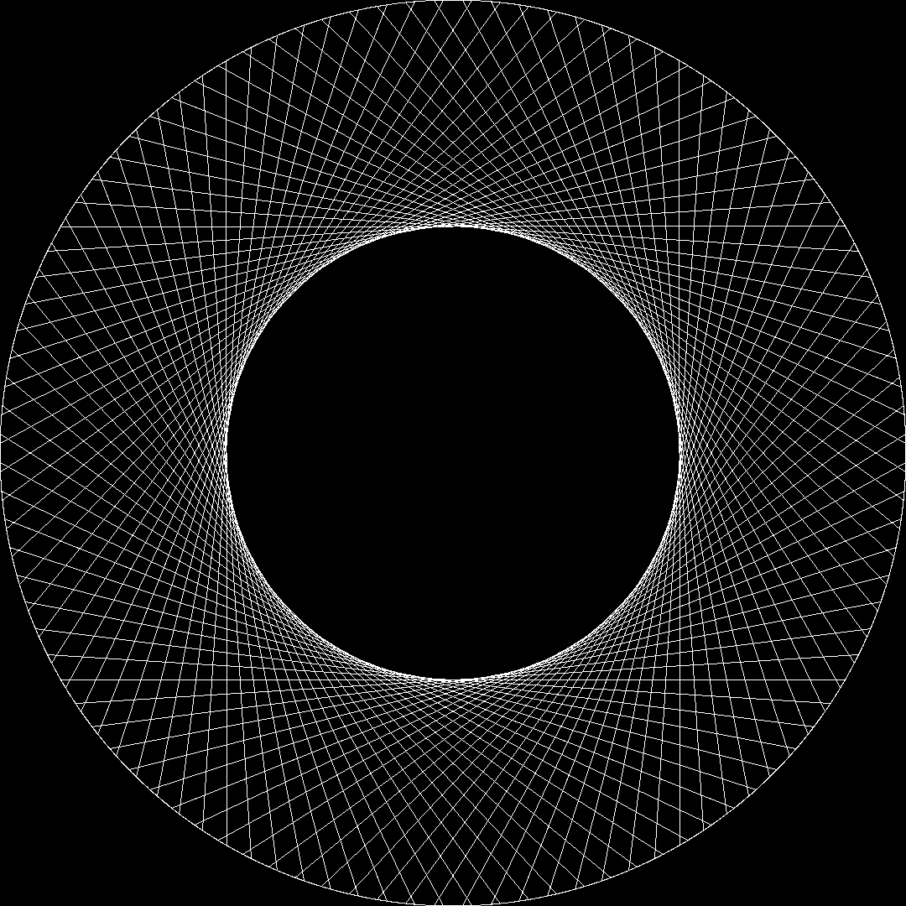
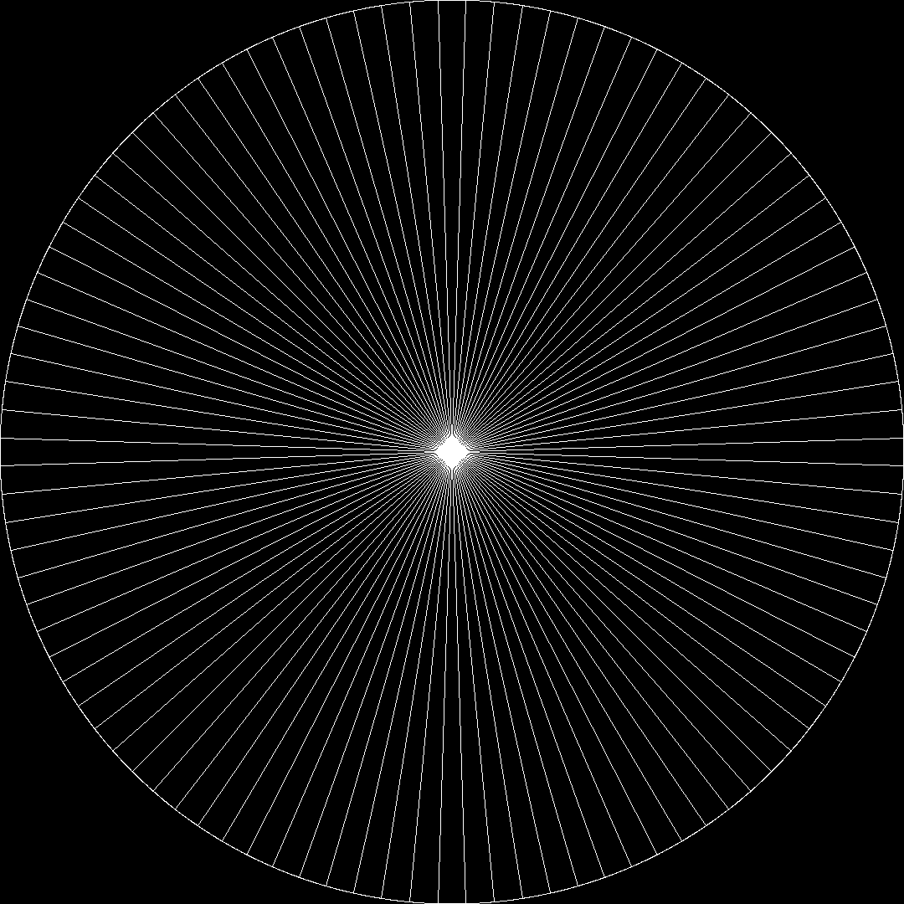
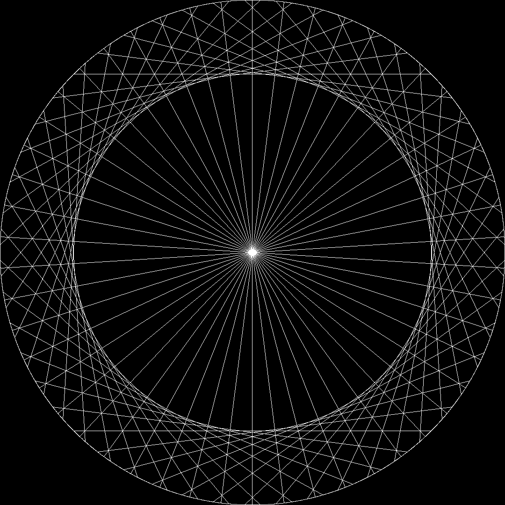
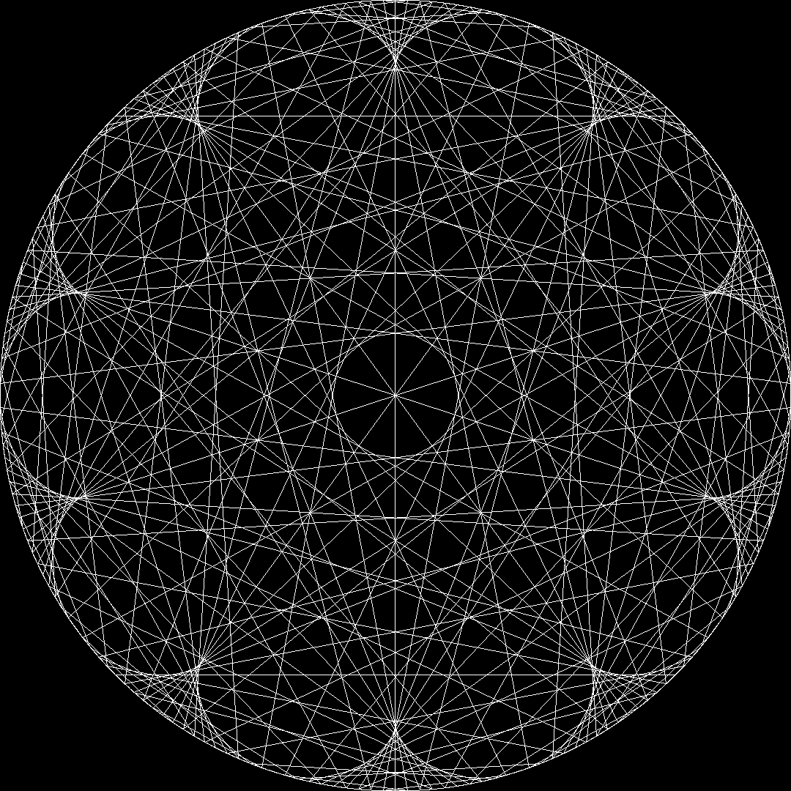
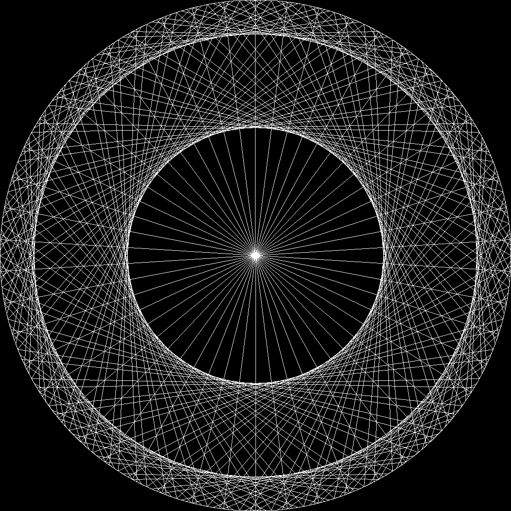

[](https://goreportcard.com/report/github.com/canberkturan/ModularMultiplicationCircle)

# Modular Multiplication Circle

This cli application creates a modular multiplication circle.

## What is Modular Multiplication Circle
-  Choose a number to put dots around the circle. (ex: 200)
-  Choose a number to multiply all dot index values. (ex: 2) -> index\*2
-  Get remainder after division of multiplication result by dot count -> (index\*2)%200 
-  Choose a number to add bias value. (ex: 0)
-  Add bias value to modulation results. -> (index\*2)%200 + 0
-  Draw lines betwees start indexes and result indexes. (lines between dots pointed index and (index\*2)%200 + 0 values.)
-  It will show what is itself.

## Examples
<table style="width:100%">
<tr>
<td></td>
<td></td>
<td></td>
</tr>
<tr>
<td></td>
<td></td>
<td></td>
</tr>
</table>

## Installation on \*nix and GNU/Linux based systems
```bash
git clone https://github.com/canberkturan/ModularMultiplicationCircle
cd ModularMultiplicationCircle
make
sudo make install
```
## Usage
-  $ modmulcircle \[OPTIONS]
>  -s Size of the picture as pixel value (default 1080)

>  -p Padding between borders and circle as pixel value (default 0)

>  -r Rotation of circle as degree (default 0)

>  -d Dot count around the circle (default 200)

>  -m Multiplication value (default 2)

>  -b Bias value (default 0)

>  -fg Foreground color (default "255 255 255") (ex: -fg "255 0 0")

>  -bg Background color (default "0 0 0") (ex: -bg "0 0 0")

>  -o Output file path (default output.png)
